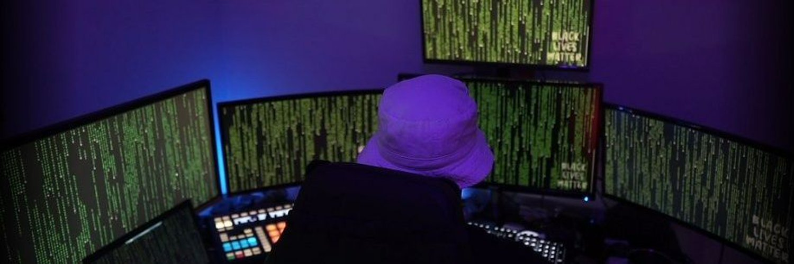
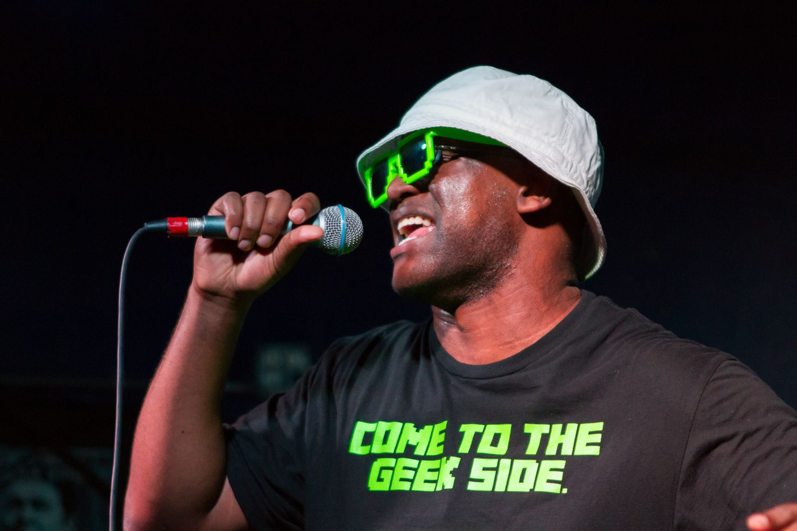

---

Sup fam. I'm Leron (aka daddycocoaman). Most of the projects here are random ideas that I come up with and try to implement in concept for potential later use. Nearly all of my projects are written in Python. My interests are primarily in pentesting/red teaming and writing tools to assist in those efforts. I've given talks at conferences on topics such as Python, Azure, and wireless security.

  
I'm also a nerdcore rapper by the name of Ohm-I. Music is mostly comedy but I've recently been writing a bunch of hacker raps. You can peep the following while you're peeping the repos.
  

- Bandcamp: https://mcohmi.bandcamp.com
- Spotify: https://open.spotify.com/artist/0Ao9oeJWukwQ48eQjklpLE
- Soundcloud: https://soundcloud.com/mc-ohm-i

<!--
**daddycocoaman/daddycocoaman** is a ✨ _special_ ✨ repository because its `README.md` (this file) appears on your GitHub profile.

Here are some ideas to get you started:

- 🔭 I’m currently working on ...
- 🌱 I’m currently learning ...
- 👯 I’m looking to collaborate on ...
- 🤔 I’m looking for help with ...
- 💬 Ask me about ...
- 📫 How to reach me: ...
- 😄 Pronouns: ...
- ⚡ Fun fact: ...
-->
